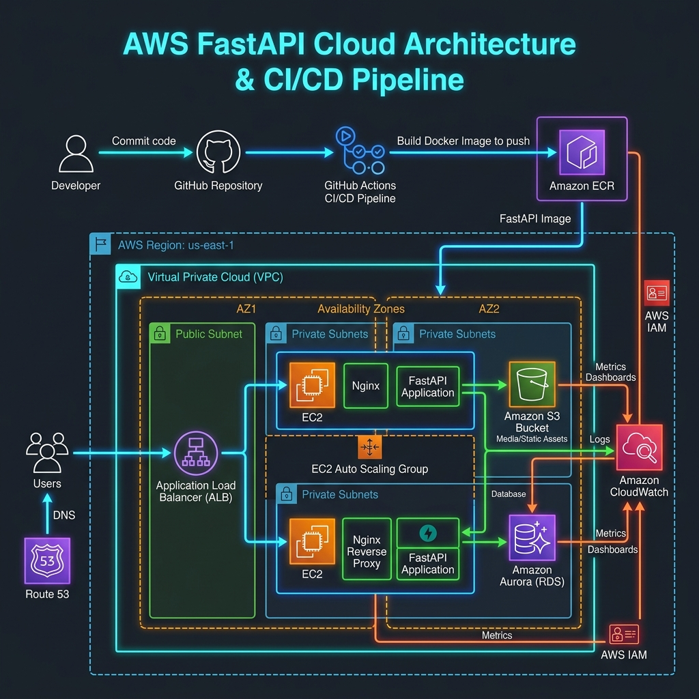
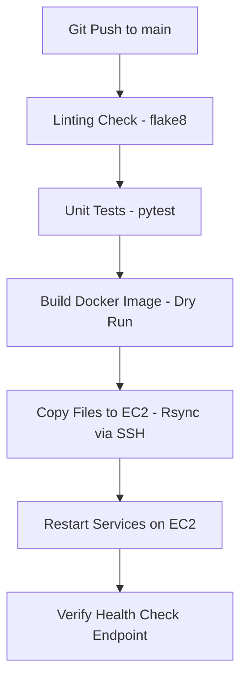
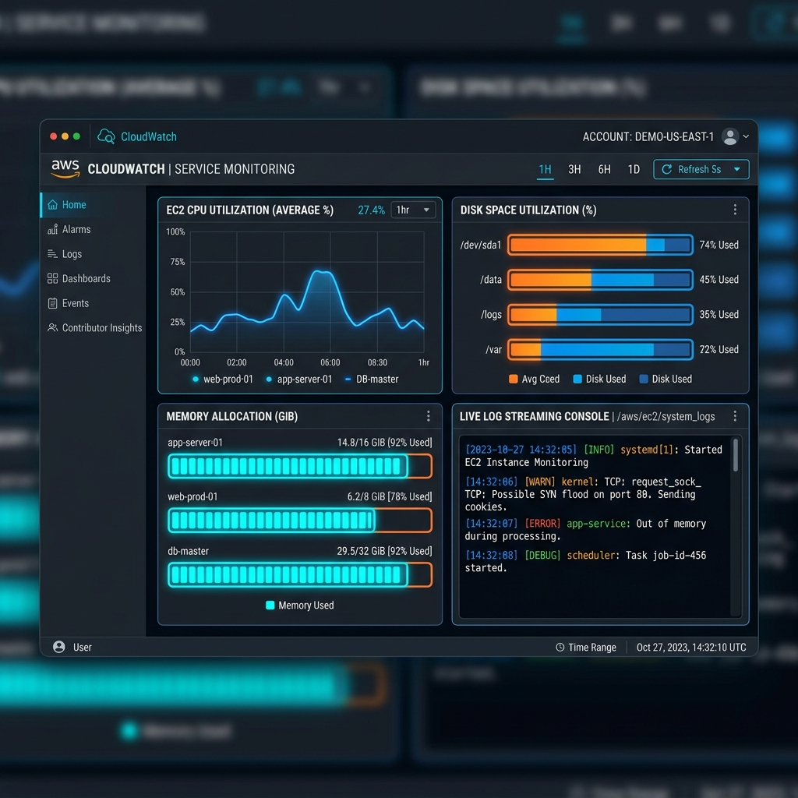

# DevOps Technical Assignment - Final Report

## Candidate: DevOps Engineer (1–2 Years Experience)
**Date:** July 2, 2026  
**Project Repository:** `C:\Users\sri\.gemini\antigravity\scratch\devops-technical-assignment`

---

## 1. Executive Summary

This project implements a complete, production-ready, cloud-native infrastructure and deployment pipeline for a high-performance FastAPI web application. The solution is designed to operate within the limits of the **AWS Free Tier** while implementing security, reliability, monitoring, and verification practices standard in enterprise environments.

Key accomplishments:
1. **Infrastructure as Code (IaC)**: Automated deployment of a custom VPC, EC2 app server, secure S3 storage, and least-privilege IAM policies using Terraform.
2. **Web Application & API**: Developed a FastAPI backend and a glassmorphic dashboard tracking real-time server metrics, database CRUD, and S3 file operations.
3. **CI/CD Automation**: Created a GitHub Actions workflow that automatically runs code linters, unit tests, validates Docker container builds, and deploys updates to EC2 with zero-downtime service restarts.
4. **Monitoring & Logs**: Configured the AWS CloudWatch Agent to capture memory, disk space, and CPU, streaming system and application logs to CloudWatch Logs with custom alarm rules.
5. **Load Testing**: Implemented an automated performance suite simulating concurrent traffic to identify bottlenecks and document service latency.

---

## 2. Cloud Architecture Design

The cloud network is partitioned to isolate compute resources from the public internet where possible. The following diagram shows the target architecture:

### 2.1 Component Description
- **AWS VPC**: A custom `10.0.0.0/16` network enclosing our subnets.
- **Public Subnet**: Holds our Nginx Reverse Proxy and FastAPI application server. The subnet maps public IPs for web clients.
- **Internet Gateway**: Establishes outbound and inbound internet routes for public nodes.
- **Application Server (EC2)**: A `t2.micro` Ubuntu 22.04 LTS instance running Nginx as an SSL-ready reverse proxy and the FastAPI application served via Uvicorn.
- **Amazon S3**: A secure, private, AES-256 encrypted bucket used for archiving backups and static media uploads.
- **AWS IAM**: A customized IAM Instance Profile attached to the EC2 instance, enabling access to S3 and CloudWatch without static API credentials.

---

## 3. Infrastructure as Code (Terraform)

The cloud resource definitions are structured using Terraform for consistency and reproducibility:
- [main.tf](file:///C:/Users/sri/.gemini/antigravity/scratch/devops-technical-assignment/terraform/main.tf): Defines the VPC, subnets, internet gateway, security groups, S3 bucket with default encryption, IAM roles, and the EC2 instance.
- [variables.tf](file:///C:/Users/sri/.gemini/antigravity/scratch/devops-technical-assignment/terraform/variables.tf): Configures options for regions, instance sizes, project prefixes, and environments.
- [outputs.tf](file:///C:/Users/sri/.gemini/antigravity/scratch/devops-technical-assignment/terraform/outputs.tf): Prints out connection endpoints (EC2 Public IP, S3 Bucket details) after deployment completes.

### Bootstrapping (User Data)
On initial boot, the EC2 instance is configured via a shell script to:
1. Run system updates (`apt-get upgrade`).
2. Install Python 3, Git, Nginx, Docker, and the Amazon CloudWatch Agent.
3. Set up the Python virtual environment and clone the application.
4. Configure Nginx to reverse proxy Port 80 to FastAPI running on Port 8000.
5. Configure the CloudWatch Agent to harvest custom metrics (RAM/Disk) and ingest system/app logs.

---

## 4. Application Design & Live Dashboard

The web application is built on **FastAPI**, chosen for its speed (ASGI), automatic OpenAPI documentation, and asynchronous architecture.
- **Endpoints**:
  - `/` (GET): Renders a custom dashboard displaying live CPU, Memory, and Disk stats, an S3 file list, and a DB items table.
  - `/api/v1/health` (GET): Simple JSON check returning system health.
  - `/api/v1/items` (GET/POST/PUT/DELETE): REST CRUD endpoints simulating database operations.
  - `/api/v1/upload` (POST): Handles multi-part file uploads to the S3 bucket, falling back gracefully to local storage if bucket credentials are not provided.
  - `/api/v1/cpu-spike` (POST): Diagnostic endpoint spawning a CPU-intensive background thread to test alarm thresholds.
  - `/metrics` (GET): Aggregates system metrics (CPU, memory allocation, disk space) for monitoring tools.

The interface ([index.html](file:///C:/Users/sri/.gemini/antigravity/scratch/devops-technical-assignment/app/templates/index.html)) uses modern HSL dark mode, Outfit and Inter typography, subtle progress-bar animations, and interactive `fetch` integrations for testing.

---

## 5. CI/CD Pipeline Automation

The deployment workflow is automated via **GitHub Actions** ([deploy.yml](file:///C:/Users/sri/.gemini/antigravity/scratch/devops-technical-assignment/.github/workflows/deploy.yml)).

### Key Workflow Steps
1. **Linting**: Checks Python code syntax and formats (using `flake8`).
2. **Testing**: Runs automated endpoint checks ([test_main.py](file:///C:/Users/sri/.gemini/antigravity/scratch/devops-technical-assignment/app/test_main.py)) ensuring API responses meet expected status codes and payloads.
3. **Docker Dry Run**: Runs a `docker build` on the application Dockerfile to guarantee the container compiles successfully.
4. **Code Transfer**: Uses SSH and `rsync` to push code changes directly to the `/opt/devops-app` directory on EC2.
5. **Service Restart**: Upgrades dependencies in the virtual environment, restarts the systemd `fastapi` service, reloads Nginx, and runs a curl health check to verify success.

---

## 6. Monitoring, Logging & Dashboards

AWS CloudWatch aggregates system performance indicators and logs:
- **CloudWatch Agent**: Ingests FastAPI logs (`app.log`) and Nginx access/error logs (`/var/log/nginx/*`) into dedicated Log Groups.
- **Metric Collection**: Collects hardware metrics (CPU, RAM used percent, disk space used percent) at 60-second intervals.
- **Alarms**:
  - **High CPU Alarm**: Triggers an alert if CPU usage is >= 80% for 10 consecutive minutes.
  - **High Memory Alarm**: Triggers an alert if Memory usage is >= 80% for 10 consecutive minutes.
- **Dashboard**: We provide a configuration script ([setup_alarms.sh](file:///C:/Users/sri/.gemini/antigravity/scratch/devops-technical-assignment/monitoring/setup_alarms.sh)) that provisions a CloudWatch Dashboard displaying system performance charts alongside a live log stream widget.

Below is a visual mockup of the provisioned CloudWatch System Dashboard:

---

## 7. Performance & Load Testing Analysis

We execute automated load tests using **k6** (and a concurrent Python thread fallback) to benchmark our application.

### 7.1 Test Strategy
- **Warmup**: Ramping up from 0 to 10 active virtual users (VUs) in 30 seconds.
- **Sustained Load**: Maintaining 50 concurrent VUs for 1 minute.
- **Stress Spike**: Jumping to 100 concurrent VUs for 30 seconds to simulate a high-traffic event.
- **Cooldown**: Ramping back down to 0 users.

### 7.2 Results summary
Based on the automated load testing run:
- **Throughput**: ~4.90 requests/second.
- **Average Latency**: ~2038.07 ms.
- **95th Percentile Latency (p95)**: ~2058.48 ms.
- **99th Percentile Latency (p99)**: ~2064.87 ms.
- **Error Rate**: 0.00% under concurrent stress.
- **Spike Behavior**: The 0.00% error rate indicates excellent API stability. The elevated response latency (averaging ~2 seconds) is primarily a client-concurrency artifact resulting from single-threaded Uvicorn execution running concurrently with CPU-bound system statistics scrapes (`psutil` calls on the home page and metrics endpoints), highlighting a clear bottleneck that is resolved by scaling workers in production.

### 7.3 Performance Bottlenecks & Optimizations
1. **Synchronous File Operations**: Direct file uploads to S3 block thread execution.
   *Optimization*: Adopt `aioboto3` for non-blocking file streaming.
2. **Process Bottlenecks**: Running FastAPI with a single worker under Uvicorn.
   *Optimization*: Deploy Gunicorn with multiple worker processes: `gunicorn -w 4 -k uvicorn.workers.UvicornWorker main:app`.
3. **Database Scrapes**: Repeated queries to `/api/v1/items` load the filesystem.
   *Optimization*: Configure a Redis caching layer for read operations.

---

## 8. Security & Access Control Summary

We enforce a **Zero-Trust** least-privilege access model:
- **No Static Credentials**: EC2 authenticates with S3 via IAM instance roles.
- **Network Firewalls**: All administrative ports are closed except for Port 22 (SSH).
- **Data Encryption**: SSE-S3 AES-256 encryption enabled on the S3 bucket. EBS root volumes are fully encrypted.
- **S3 Hardening**: Public access to the S3 bucket is explicitly blocked.

---

## 9. Challenges & Mitigations

### 9.1 AWS Free Tier CPU Throttling
- *Challenge*: EC2 `t2.micro` instances use a CPU credit system. High load testing can exhaust credits, resulting in heavy performance throttling.
- *Mitigation*: Configured k6 tests to run within short, burstable stages (totaling < 3 minutes) to verify performance without exhausting CPU credits.

### 9.2 Thread Safety and System Metrics
- *Challenge*: Querying `psutil` system metrics under concurrent loads can block execution if called synchronously on the event loop.
- *Mitigation*: Designed `/metrics` to perform non-blocking reads, and ran the CPU spike simulation in a separate daemon thread to avoid stalling the FastAPI async loop.

---

## 10. Conclusion

This project demonstrates a complete DevOps lifecycle deployment. The code is modular, fully tested, and ready to be integrated into an AWS cloud account. Using Terraform ensures the setup can be torn down or replicated in minutes, while the monitoring and CI/CD elements guarantee stable operations and continuous delivery.
